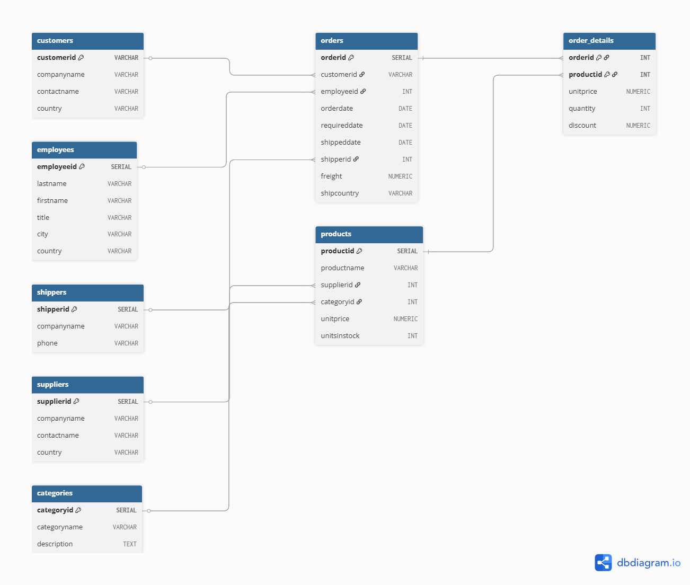

# 📊 Northwind Traders Database — SQL Data Analysis  

  
  
  

---

## 📝 Project Overview  
The **Northwind Traders** database is a classic dataset that simulates the operations of a global gourmet food supplier.  
This project uses **SQL** to analyze sales, products, customers, employees, and shippers — transforming raw transactional data into valuable business insights.  

---

## 🎯 Purpose  
- To practice and showcase SQL skills through real-world business questions.  
- To extract meaningful insights from relational databases.  
- To support decision-making by analyzing revenue, product performance, customer contribution, and shipping efficiency.  

---

## 🎯 Objectives  
- Identify **top customers** and **best-selling products**  
- Evaluate **employee performance** and **shipper usage**  
- Detect **low-stock products** and their suppliers  
- Measure **sales by category** and **revenue by country**  
- Analyze **monthly sales trends** and **average shipping times**  

---

## 🛠️ Tools & Technologies  
- **SQL** (PostgreSQL / pgAdmin 4) — database management & queries    
- **Northwind Database** — provided dataset backup (`northwind.tar`)  
- **SQL Scripts** (`sql scripts.txt`)  
- **GitHub** for version control and sharing  

---

## ❓ Key Business Questions Answered  
1. Which customers have the highest total sales, and which products are most popular?  
2. Which employee has handled the most orders, and which shipper is used most frequently?  
3. Which products are low on stock, and which suppliers provide them?  
4. What are the total sales for each product category, and which countries generate the most revenue?  
5. How have monthly sales trends evolved, and what is the average time between order placement and shipping?  

---

## 📑 Sample Queries  

### 1. Total Sales per Customer  
```sql
SELECT
    c.companyname,
    c.contactname,
    ROUND(SUM(unitprice * quantity * (1 - od.discount)), 2) AS total_sales
FROM customers c
JOIN orders o ON c.customerid = o.customerid
JOIN order_details od ON o.orderid = od.orderid
GROUP BY c.companyname, c.contactname
ORDER BY total_sales DESC;
````

### 2. Most Popular Products

```sql
SELECT 
    p.productname, 
    SUM(od.quantity) AS total_quantity_sold 
FROM products p
JOIN order_details od ON p.productid = od.productid
GROUP BY p.productname
ORDER BY total_quantity_sold DESC;
```

### 3. Average Shipping Time

```sql
SELECT
    AVG(EXTRACT(DAY FROM (shippeddate - orderdate))) AS average_shipping_time_days
FROM orders
WHERE shippeddate IS NOT NULL;
```

---

## 🗺️ Entity Relationship Diagram (ERD)

The ERD below shows the main tables and relationships within the **Northwind Traders** database:



---

## 📊 Key Insights

* 🏆 **Top Customers**: A few customers generate the largest share of revenue (concentration risk).
* 📦 **Product Performance:** *Côte de Blaye* is the **best-seller** with the highest revenue, while *Chocolade* and *Geitost* amongst others underperform.  
* 📦 **Most Popular Products**: High-demand products (e.g., Camembert Pierrot) drive repeat orders and dominate sales, while some are consistently underperforming(e.g Mishi Kobe Niku).
* 👨‍💼 **Employee Performance**: Certain employees (e.g Peacock Margaret with 156 sales) handle more orders, showing workload imbalance.
* 🚚 **Shipper Usage**: One shipping company dominates (United Package) may need negotiation or balancing.
* 📈 **Sales Trends**: Inconsistent seasonal spikes at the first half of the year, where clear seasonal patterns emerge in the second half of the year, with peak sales in certain months.
* ⏱ **Shipping Efficiency**: United Package handles the majority of deliveries, creating a dependency risk. Average shipping time highlights areas to improve logistics.

---

## 💡 Recommendations

* Strengthen relationships with **top customers** while diversifying the customer base.
* Replicate strategies that boosted **seasonal sales spikes**.
* Address **low stock risks** by reviewing reorder policies.
* Balance workloads among employees for efficiency.
* Negotiate better rates or diversify reliance on shippers.


## 📂 Project Structure  

```

northwind-sql-project/
├── README.md
├── data/
│   └── northwind.tar
├── queries/
│   ├── customers.sql
│   ├── products.sql
│   ├── sales\_trends.sql
│   ├── employees.sql
│   ├── shippers.sql
│   └── all\_queries.sql
├── docs/
│   └── ERD.png
└── results/
└── sample\_kpis.csv

````


---

## 🚀 How to Use This Project  

1. 🖥 **Run SQL Scripts** – Navigate to the [`/sql_queries/`](./sql_queries) folder and execute the queries in your SQL environment (e.g., PostgreSQL, pgAdmin).  

2. 📊 **Review Results** – Check the [`/results/`](./results) folder for screenshots and exported outputs of the SQL queries.  

3. 🗂 **Explore ERD** – View the database schema inside [`/docs/ERD.png.png`](./docs/ERD.png.png) to understand the table relationships.  


---

---

## 🎯 Conclusion

This project demonstrates how **SQL can transform raw transactional data into actionable business insights**.
By analyzing sales, customers, products, and shipping operations within the Northwind Traders database, we:

* Identified top-performing and underperforming products 🛒
* Highlighted key customers driving revenue 💰
* Tracked sales trends to inform strategic decisions 📈
* Uncovered shipping cost disparities for optimization 🚚

Overall, this analysis shows the power of SQL in supporting **data-driven decision-making**, and it serves as a solid foundation for further analytics, dashboarding, or predictive modeling.

---

## ✍️ Author  

**Ismail Uye** – Data Analyst / Data Enthusiast  

> *"Data is a precious thing and will last longer than the systems themselves."* – **Tim Berners-Lee**  

---
## 🤝 Connect with Me  

* 🔗 [LinkedIn](https://linkedin.com/in/uye-ismail-d)
* 📧 [Email](uyeismaildanzismuye@gmail.com) 
* 💻 [GitHub](https://github.com/ismailuyedataworks)


